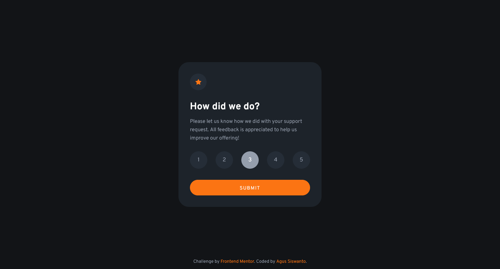

# Frontend Mentor - Interactive rating component solution

This is a solution to the [Interactive rating component challenge on Frontend Mentor](https://www.frontendmentor.io/challenges/interactive-rating-component-koxpeBUmI). Frontend Mentor challenges help you improve your coding skills by building realistic projects.

## Table of contents

- [Frontend Mentor - Interactive rating component solution](#frontend-mentor---interactive-rating-component-solution)
  - [Table of contents](#table-of-contents)
  - [Overview](#overview)
    - [The challenge](#the-challenge)
    - [Screenshot](#screenshot)
    - [Links](#links)
  - [My process](#my-process)
    - [Built with](#built-with)
    - [Useful resources](#useful-resources)
  - [Author](#author)

**Note: Delete this note and update the table of contents based on what sections you keep.**

## Overview

### The challenge

Users should be able to:

- View the optimal layout for the app depending on their device's screen size
- See hover states for all interactive elements on the page
- Select and submit a number rating
- See the "Thank you" card state after submitting a rating

### Screenshot

### Links

- Solution URL: [Frontend Mentor Challenge Solution](https://www.frontendmentor.io/solutions/interactive-rating-component-using-grid-flexbox-sass-bem-6Jm9_ZTujo)
- Live Site URL: [Interactive Rating Component](https://fem-interactive-rating-component-good.netlify.app/)

## My process

### Built with

- Semantic HTML5 markup
- SCSS/SASS
- Flexbox
- CSS Grid
- Mobile-first workflow
- NPM Package dev dependency: vite, sass & autoprefixer for crossbrowser compatibility.

### Useful resources

- [Aligning a Button Label Vertically](https://ishadeed.com/article/button-label-alignment/) - This is a CSS tricks for aligning a button label vertically due to visually uneven font construction.
- [Space in Design Systems](https://medium.com/eightshapes-llc/space-in-design-systems-188bcbae0d62) - This is an amazing article which helped me finally understand about space in design systems. I'd recommend it to anyone still learning this concept.
- [Leading Trim](https://medium.com/microsoft-design/leading-trim-the-future-of-digital-typesetting-d082d84b202) - A CSS new feature for aligning text vertically.
- [The 4px Baseline Grid](https://uxdesign.cc/the-4px-baseline-grid-89485012dea6) - A CSS trick for aligning text vertically.

## Author

- Frontend Mentor - [@siswantodev](https://www.frontendmentor.io/profile/siswantodev)
